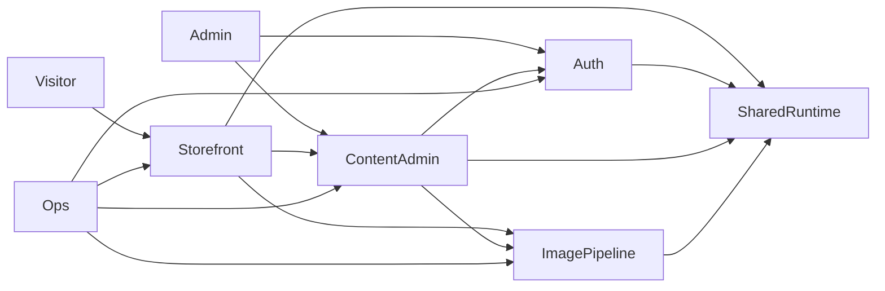

# Solution

Retrospective extraction from verified `_docs/02_document/` (2026-08-26). Describes the system that exists, not a proposed rewrite.

## Product Solution Description

A single Next.js 15 App Router site for Dianych: public storefront (five filesystem galleries, frame prices, UA/EN copy) plus a one-password `/manage` CMS. Visitors order by leaving to Instagram/social. Images live on a host volume; prices in JSON; thumbs are sharp-generated WebP data-URLs with memory + `/tmp` cache. Production is one standalone Docker container behind host nginx/TLS. No database, no CI, no inbound vendor APIs.

## Existing/Competitor Solutions Analysis

Not researched. This is a custom single-brand shop, not a catalog CMS. Stock Next.js / Vercel / Shopify / Instagram-shop alternatives were not evaluated in-repo. README is create-next-app boilerplate.

## Architecture

### Component: Shared Runtime

| Solution | Tools | Advantages | Limitations | Requirements | Security | Cost | Fit |
|----------|-------|------------|-------------|--------------|----------|------|-----|
| First-party helpers | iron-session 8.0.4, React context | One session + listing + locale kernel | Locale not persisted | Node + Next cookies | Cookie `secure` in production; empty secret fails at runtime | Included | Selected |

### Component: Image Pipeline

| Solution | Tools | Advantages | Limitations | Requirements | Security | Cost | Fit |
|----------|-------|------------|-------------|--------------|----------|------|-----|
| sharp → WebP data-URL packs | sharp 0.33.5, process Map, `/tmp` JSON | Avoids `/_next/image`; works with `unoptimized` | Invalidate only width 500; first-visit pack cost; `jimp` unused | libvips in image; writable `/tmp` | Gallery/filename allow-lists | CPU on miss | Selected |

### Component: Auth

| Solution | Tools | Advantages | Limitations | Requirements | Security | Cost | Fit |
|----------|-------|------------|-------------|--------------|----------|------|-----|
| Single bcrypt file + cookie | bcryptjs 3.0.2, iron-session | No user table | Shared password; secret rotated every container start; in-memory rate limit | `pw.txt`, `SECRET_COOKIE_PASSWORD` | 5 / 15 min / IP; `/manage` middleware | Included | Selected |

### Component: Content Admin

| Solution | Tools | Advantages | Limitations | Requirements | Security | Cost | Fit |
|----------|-------|------------|-------------|--------------|----------|------|-----|
| Server Actions + prices REST | Next server actions, fs | Owner edits without a developer | Nested prices path; `getGalleryImages` unauthenticated | Bind-mounted `public/images` | Magic bytes + path prefix; session on mutate | Included | Selected |

### Component: Storefront

| Solution | Tools | Advantages | Limitations | Requirements | Security | Cost | Fit |
|----------|-------|------------|-------------|--------------|----------|------|-----|
| App Router + client islands | Next 15.5.2, React 19, Tailwind 4, embla 8.6.0 | Marketing site + live prices | `html lang` stays `en`; clothes missing from header nav | Readable gallery dirs | Public GETs only | Included | Selected |

### Component: Ops

| Solution | Tools | Advantages | Limitations | Requirements | Security | Cost | Fit |
|----------|-------|------------|-------------|--------------|----------|------|-----|
| Standalone Docker + host nginx | Node 20 bookworm-slim, certbot | Simple one-host deploy | No CI/compose; nginx alias ≠ volume; no metrics | Host Docker + nginx | Read-only root, non-root `node`, noexec | Host + registry | Selected |

## Testing Strategy

No test runner in the repo. Downstream Phase A test-spec should cover:

### Integration / Functional Tests
- Login 400/401/429 and success redirect to `/manage`
- Unauthenticated mutations rejected (actions + prices POST + pack invalidate)
- Upload/delete path traversal and non-image rejection
- Prices GET defaults and POST echo
- Gallery-pack / image 400 on bad `galleryId`/`name`
- Empty gallery folder omits carousel (no 500)

### Non-Functional Tests
- Thumb HTTP `Cache-Control` max-age 300
- Disk cache cap 500 MB
- Login rate window 15 minutes
- Upload body limit 20 MB (serverActions)

## References

- `_docs/02_document/architecture.md`
- `_docs/02_document/system-flows.md`
- `_docs/02_document/components/*/description.md`
- `_docs/02_document/04_verification_log.md`
- `_docs/00_problem/infra_topology.md`

## Related Artifacts

- Tech stack: `architecture.md` §2 (no separate `tech_stack.md`)
- Security: `_docs/00_problem/security_approach.md` (Step 6e)
