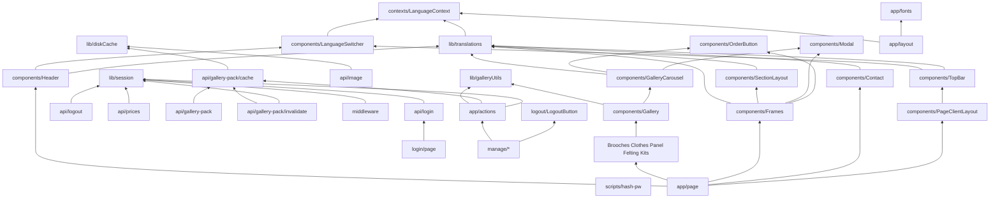

# Codebase Discovery

Mode: Full. No FOCUS_DIR.

DOCUMENT_DIR: `_docs/02_document/`
SOLUTION_DIR: `_docs/01_solution/`
PROBLEM_DIR: `_docs/00_problem/`

## Directory tree (source and ops; excludes `node_modules`, `.git`, `.next`)

```
dianych.com/
├── build.cmd                 # Windows: docker build + push to docker.azaion.com
├── install.sh                # nginx TLS vhost + certbot for dianych.com
├── restart.sh                # recreate container, generate new session secret
├── update.sh                 # pull image + recreate container
├── package-lock.json         # empty root lock (name: dianych.com)
├── design/
│   ├── Dianych_v1.pdf
│   └── Site_mechanics.pdf
└── dianych-website/          # Next.js 15 App Router application
    ├── Dockerfile            # multi-stage standalone Node 20 + sharp/libvips
    ├── middleware.ts         # /manage session gate
    ├── app/
    │   ├── layout.tsx, page.tsx, fonts.ts, globals.css, actions.ts
    │   ├── api/              # login, logout, prices, image, gallery-pack
    │   ├── components/       # public storefront sections + gallery
    │   ├── login/, logout/, manage/
    ├── contexts/LanguageContext.tsx
    ├── lib/                  # session, galleryUtils, diskCache, translations
    ├── data/framePrices.json
    ├── dianych-website/data/framePrices.json   # nested copy (cwd-relative path)
    ├── public/images/{brooches,clothes,panel,felting,kits,flags}
    ├── public/static-images/
    └── scripts/hash-pw.js
```

Binary / non-code: `design/*.pdf`, `public/**` images, `app/fonts/vinnytsia_serif.woff2`, `app/favicon.ico`. Nested `dianych-website/dianych-website/` is not a second app.

## Tech stack

| Area | Choice | Evidence |
|------|--------|----------|
| Language | TypeScript 5 | `package.json`, `tsconfig.json` |
| UI | Next.js 15.5.2 App Router, React 19, Tailwind 4 | `package.json`, `app/` |
| Session | iron-session cookie `dianych-manage-session` | `lib/session.ts` |
| Password | bcryptjs vs `pw.txt` hash | `app/api/login/route.ts`, `scripts/hash-pw.js` |
| Images | sharp + jimp (jimp unused in scanned imports), disk cache 500MB | `app/api/image`, `lib/diskCache.ts` |
| Carousel | embla-carousel-react | `GalleryCarousel.tsx` |
| Runtime | Node 20 bookworm-slim, `output: 'standalone'` | `Dockerfile`, `next.config.ts` |
| Reverse proxy | nginx 443 → localhost:3001 | `install.sh` |
| Registry | docker.azaion.com | `build.cmd` |
| Tests | none | no `*.test.*` / `*.spec.*` / test runner script |
| CI | none | no `.github/`, `.woodpecker/`, or compose |

## Entry points

| Entry | Role |
|-------|------|
| `dianych-website/app/layout.tsx` | HTML shell, font, `LanguageProvider` |
| `dianych-website/app/page.tsx` | Public landing (galleries + contact) |
| `dianych-website/app/login/page.tsx` | Admin password form → `POST /api/login` |
| `dianych-website/app/manage/page.tsx` | Admin gallery + prices (middleware-protected) |
| `dianych-website/middleware.ts` | Redirect unauthenticated `/manage` → `/login` |
| `dianych-website/app/api/*/route.ts` | Route handlers |
| `dianych-website/app/actions.ts` | Server actions: upload / delete / list gallery |
| `dianych-website/scripts/hash-pw.js` | CLI to write bcrypt hash to `pw.txt` |
| `build.cmd` / `restart.sh` / `update.sh` / `install.sh` | Image + host ops |

## Existing docs

- `dianych-website/README.md` — stock create-next-app text (Geist/Vercel); does not describe this product.
- `design/Dianych_v1.pdf`, `design/Site_mechanics.pdf` — original design (binary; not parsed here).

## Test structure

None. No unit, integration, or e2e harness.

## Dependency graph

Leaves first. External libs omitted from edges.



Cycles: none among first-party modules.

## Topological order (module docs)

1. `lib/diskCache`
2. `lib/galleryUtils`
3. `lib/session`
4. `contexts/LanguageContext`
5. `app/fonts`
6. `scripts/hash-pw`
7. `lib/translations`
8. `app/api/gallery-pack/cache`
9. `app/api/image`
10. `app/api/login`
11. `app/api/logout`
12. `app/api/prices`
13. `app/api/gallery-pack` (route + invalidate)
14. `middleware`
15. `app/actions`
16. `components/OrderButton`
17. `components/Modal`
18. `components/LanguageSwitcher`
19. `components/SectionLayout`
20. `components/Contact`
21. `components/GalleryCarousel`
22. `components/Gallery`
23. `components/Frames` (+ empty `FrameCard.tsx`)
24. `components/gallery-sections` (Brooches, Clothes, Panel, Felting, Kits)
25. `components/chrome` (Header, TopBar, PageClientLayout)
26. `app/login` + `app/logout`
27. `app/manage`
28. `app/layout` + `app/page`
29. `ops-scripts` (install/restart/update/build + Dockerfile)

## Leaf vs entry

| Kind | Modules |
|------|---------|
| Leaves | diskCache, galleryUtils, session, LanguageContext, fonts, hash-pw, OrderButton, Modal |
| Entries | layout/page, middleware, API routes, actions, ops-scripts |

## Notable findings (discovery only)

- Prices path is `process.cwd()/dianych-website/data/framePrices.json`. App cwd is `dianych-website/`, so runtime file is the nested copy.
- `FrameCard.tsx` is empty and unreferenced.
- `jimp` is in `package.json` with no scanned import.
- `restart.sh` / `update.sh` set a new `SECRET_COOKIE_PASSWORD` on every recreate (sessions drop).
- nginx image alias in `install.sh` (`/root/dianych/images/`) does not match the docker volume in `restart.sh` (`/var/www/dianych/images`).
- `pw.txt` is dockerignored; root `.gitignore` has `pw.txt` (not `dianych-website/pw.txt` unless matched by name — root pattern `pw.txt` matches any path named `pw.txt`).
