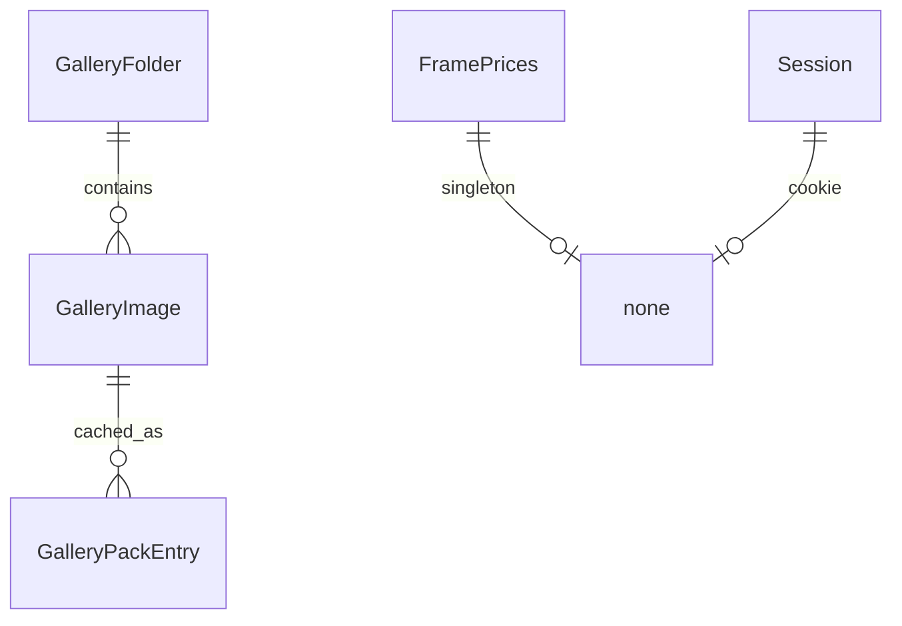

# Data model

No SQL/ORM. Persistences:

## GalleryImage

| Field | Type | Notes |
|-------|------|-------|
| galleryId | string | folder name; allow-list on writes |
| filename | string | sanitized `[a-zA-Z0-9._-]` on upload |
| bytes | file | `public/images/<galleryId>/<filename>` |

## GalleryPack / SingleImage cache

| Field | Type | Notes |
|-------|------|-------|
| galleryId, name, width, version | key | memory + tmp JSON |
| dataUrl | string | `data:image/webp;base64,...` |

## FramePrices

| Field | Type | Default |
|-------|------|---------|
| smallFrame8 | number | 450 |
| smallFrame10 | number | 500 |
| mediumFrame14 | number | 600 |
| largeFrame19 | number | 700 |

File: `process.cwd()/dianych-website/data/framePrices.json` (nested copy when cwd is `dianych-website/`). Canonical-looking `dianych-website/data/framePrices.json` is unused at runtime.

## Session

| Field | Type |
|-------|------|
| isLoggedIn | boolean optional |

Cookie name `dianych-manage-session`.

## PasswordHash

Single bcrypt line in `pw.txt`.

## Migrations / seed / compat

None. Defaults written if prices file missing. No schema version field.
