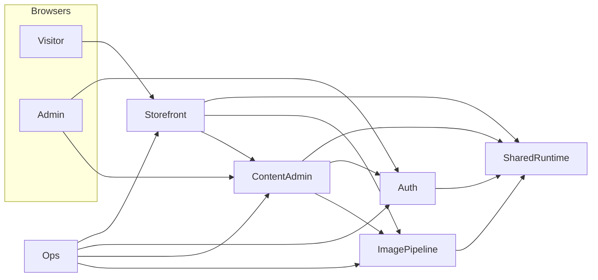

# Component relationships

## Module → component map

| Component | Modules |
|-----------|---------|
| 01 Shared Runtime | diskCache, galleryUtils, session, LanguageContext, translations, fonts |
| 02 Image Pipeline | gallery-pack/cache, gallery-pack routes, api/image |
| 03 Auth | api/login, api/logout, middleware, hash-pw, login-logout pages |
| 04 Content Admin | actions, api/prices, app/manage |
| 05 Storefront | OrderButton, Modal, LanguageSwitcher, SectionLayout, Contact, GalleryCarousel, Gallery, Frames, gallery-sections, chrome, layout-page |
| 06 Ops | ops-scripts |
