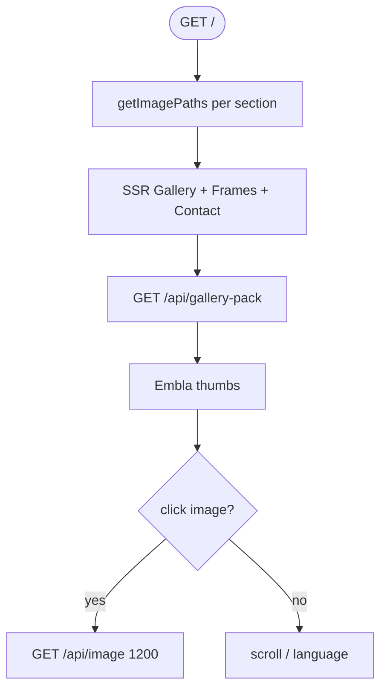

# F1 Browse + F2 Thumbs

See `system-flows.md` sequence diagrams. Combined:

```mermaid
flowchart TD
  Start([GET /]) --> List[getImagePaths per section]
  List --> Render[SSR Gallery + Frames + Contact]
  Render --> Pack[GET /api/gallery-pack]
  Pack --> Show[Embla thumbs]
  Show --> Click{click image?}
  Click -->|yes| Modal[GET /api/image 1200]
  Click -->|no| Idle[scroll / language]
```
