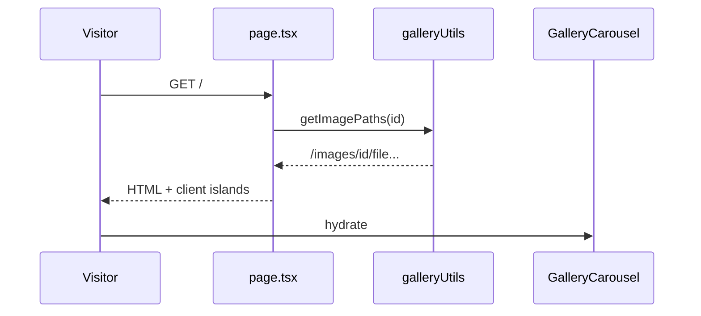
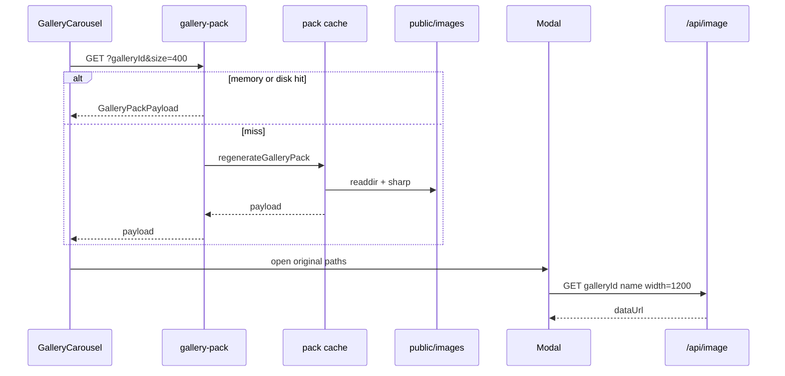
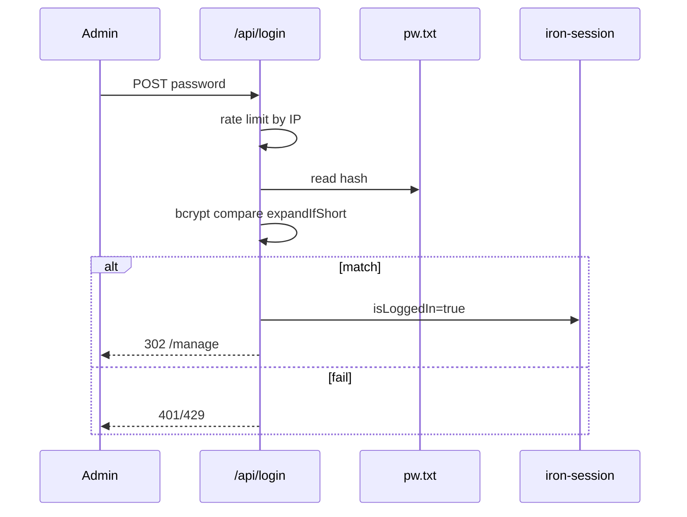
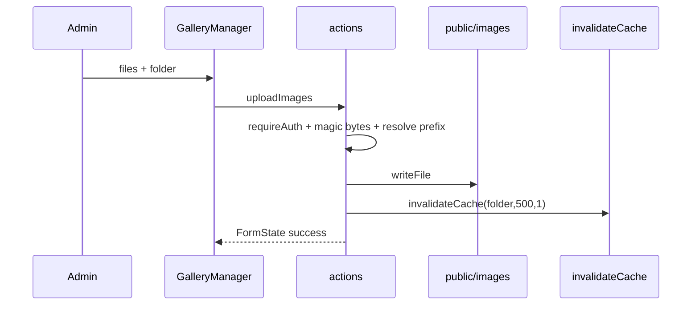

# DIANYCH website — System Flows

## Flow Inventory

| # | Flow Name | Trigger | Primary Components | Criticality |
|---|-----------|---------|-------------------|-------------|
| F1 | Browse storefront | GET `/` | storefront, shared-runtime | High |
| F2 | Gallery thumbs + lightbox | carousel/modal | storefront, image-pipeline | High |
| F3 | Admin login | POST `/api/login` | auth | High |
| F4 | Upload / delete gallery image | manage forms | content-admin, image-pipeline | High |
| F5 | Edit frame prices | PricesManager | content-admin, storefront | Medium |
| F6 | Logout | LogoutButton | auth | Low |
| F7 | Host update | `update.sh` | ops | High |

## Flow Dependencies

| Flow | Depends On | Shares Data With |
|------|-----------|-----------------|
| F1 | — | F2 (image paths), F5 (defaults until prices load) |
| F2 | F1 listed paths | F4 (invalidation / stale cache) |
| F3 | `pw.txt` + `SECRET_COOKIE_PASSWORD` | F4, F5 |
| F4 | F3 | F1, F2 |
| F5 | F3 for write | F1 Frames |
| F6 | F3 | — |
| F7 | image in registry | all (new secret) |

## Flow F1: Browse storefront

### Description

Visitor opens `/`. Server reads five gallery folders and renders sections; client shows language, sticky bar after 400px, contact links.

### Preconditions

- App process running; `public/images/<id>` readable (empty → section hidden)

### Sequence Diagram

### Error scenarios

| Error | Handling |
|-------|----------|
| Missing gallery dir | `[]` → carousel returns null |
| Missing static asset | broken image |

## Flow F2: Gallery thumbs + lightbox

### Description

Carousel loads `/api/gallery-pack`; click opens Modal which loads `/api/image` (1200px) with localStorage.

### Sequence Diagram

### Error scenarios

| Error | Handling |
|-------|----------|
| Pack HTTP error | show original `/images/...` URLs |
| Image 400/500 | pulse placeholder |
| localStorage quota | ignore; refetch next time |

## Flow F3: Admin login

### Error scenarios

| Error | Handling |
|-------|----------|
| No password | 400 |
| Bad password | 401 |
| Too many tries | 429 |
| Missing pw.txt | 500 |
| Login page | does not show JSON errors |

## Flow F4: Upload / delete gallery image

Delete is the same with `unlink` and path allow-list.

### Error scenarios

| Error | Handling |
|-------|----------|
| Not logged in | FormState error |
| Bad folder / type / traversal | FormState error |
| Invalidate fail | swallowed; files still written |

## Flow F5: Edit frame prices

GET `/api/prices` public; POST requires session; writes nested JSON; Frames refetches on mount (`no-store`).

### Error scenarios

| Error | Handling |
|-------|----------|
| GET fail | Frames keeps 450/500/600/700 |
| POST 401/400 | PricesManager shows message |

## Flow F6: Logout

POST `/api/logout` → destroy cookie → `router.refresh()` → middleware → `/login`.

## Flow F7: Host update

`update.sh`: stop/rm, pull `docker.azaion.com/dianych:latest`, run port 3001, new `SECRET_COOKIE_PASSWORD`, remount images. All sessions die.

## Data-flow table

| Source | Transform | Destination |
|--------|-----------|-------------|
| `public/images/*` | sharp WebP | tmp JSON + browser |
| Admin upload | validate + write | same dirs |
| Prices JSON | Number coerce | GET `/api/prices` |
| Password | expand + bcrypt | session cookie |
