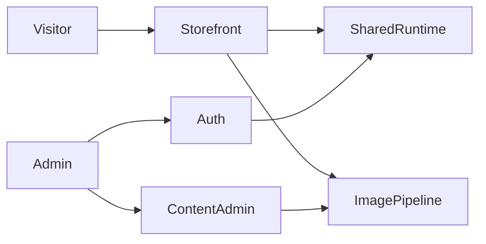

# Solution (this run)

Existing system: see `_docs/01_solution/solution.md`. This file is the refactor-run copy — project `solution.md` was not overwritten.

This run only removes dead files and one duplicated helper / gallery-id catalog. No architecture change.
